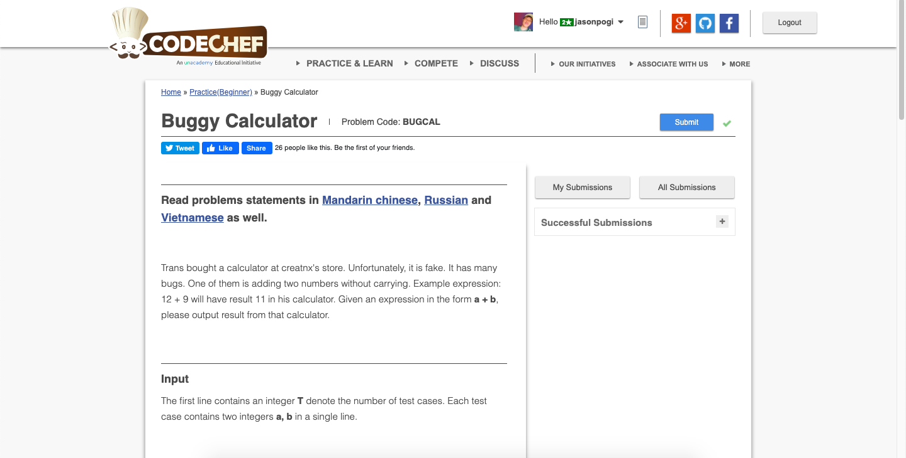

# Codechef-Buggy-Calculator
### Problem

### Program Simulation
<pre>
  Sample Input: 12 9
  
  a = 12
  b = 9
  
  A = {2,1}
  B = {9}
  
  while(A.size() < B.size()) // false
  
  while(B.size() < A.size()) // true
    B.push_back(0)
  
  B = {9,0}
  
  A[0] + B[0] = 2 + 9 = 11
  A[0] = 11
  
  A[1] + B[1] = 1 + 0 = 1
  A[1] = 1
  
  ans = 0
  
  reverse(A.begin(), A.end())
  
  A[0] = 1
  A[1] = 11
  
  * First Loop *
    ans = ans * 10 + 1 % 10
    ans = 1
  * Second Loop *
    ans = ans * 10 + 11 % 10
    ans = 11
  
  print ans
  
  Final Output:
  11
  

  Sample Input: 25 25
  
  a = 25
  b = 25
  
  A = {5,2}
  B = {5,2}
  
  while(A.size() < B.size()) // false
  
  while(B.size() < A.size()) // false
  
  A[0] + B[0] = 5 + 5 = 10
  A[0] = 10
  
  A[1] + B[1] = 2 + 2 = 4
  A[1] = 4
  
  ans = 0
  
  reverse(A.begin(), A.end())
  
  A[0] = 4
  A[1] = 10
  
  * First Loop *
    ans = ans * 10 + 4 % 10
    ans = 4
  * Second Loop *
    ans = ans * 10 + 10 % 10
    ans = 40
  
  print ans
  
  Final Output:
  40
</pre>
